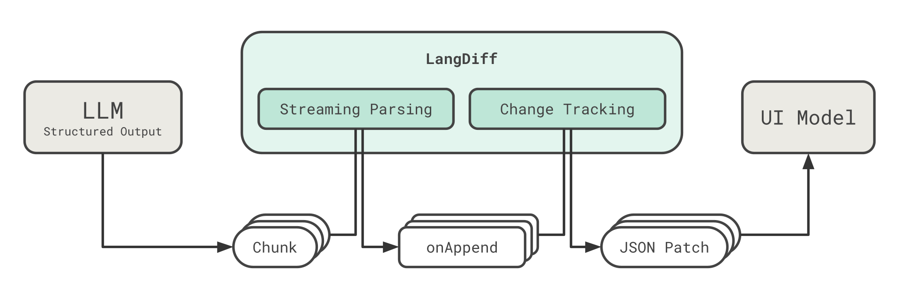

# ⚖️ LangDiff: Progressive UI from LLM

[](https://www.npmjs.com/package/langdiff-ts)
[](https://github.com/globalaiplatform/langdiff/blob/main/LICENSE)
[](https://globalaiplatform.com/)

LangDiff is a TypeScript library that solves the hard problems of streaming structured LLM outputs to frontends.



LangDiff provides intelligent partial parsing with granular, type-safe events as JSON structures build token by token, plus automatic JSON Patch generation for efficient frontend synchronization. Build responsive AI applications where your backend structures and frontend experiences can evolve independently. Read more about it on the [Motivation](#motivation) section.

## Demo

Click the image below.

[](https://globalaiplatform.github.io/langdiff/)


## Core Features

### Streaming Parsing
- Define schemas for streaming structured outputs using class-based models.
- Receive granular, type-safe callbacks (`onAppend`, `onUpdate`, `onComplete`) as tokens stream in.
- Full TypeScript support for type safety and IntelliSense.

<table>
<tr>
<td>Without LangDiff</td> <td>With LangDiff</td>
</tr>
<tr>
<td>

```typescript
parsePartial('{"it')
parsePartial('{"items":')
parsePartial('{"items": ["Buy a b')
parsePartial('{"items": ["Buy a banana", "')
parsePartial('{"items": ["Buy a banana", "Pack b')
parsePartial('{"items": ["Buy a banana", "Pack bags"]}')
```

</td>
<td>

```typescript
onItemListAppend("", index=0)
onItemAppend("Buy a b")
onItemAppend("anana")
onItemListAppend("", index=1)
onItemAppend("Pack b")
onItemAppend("ags")
```

</td>
</tr>
</table>

### Change Tracking
- Track mutations without changing your code patterns by instrumenting existing objects and arrays.
- Generate JSON Patch diffs automatically for efficient state synchronization between frontend and backend.

<table>
<tr>
<td>Without LangDiff</td> <td>With LangDiff</td>
</tr>
<tr>
<td>

```http
data: {"it
data: ems":
data:  ["Buy a b
data: anana", "
data: Pack b
data: ags"]}
```

</td>
<td>

```http
data: {"op": "add", "path": "/items/-", "value": "Buy a b"}
data: {"op": "append", "path": "/items/0", "value": "anana"}
data: {"op": "add", "path": "/items/-", "value": "Pack b"}
data: {"op": "append", "path": "/items/1", "value": "ags"}
```

</td>
</tr>
</table>

## Usage

### Installation

```bash
npm install langdiff
```

For yarn:

```bash
yarn add langdiff
```

### Streaming Parsing

Suppose you want to generate a multi-section article with an LLM. Rather than waiting for the entire response, 
you can stream the article progressively by first generating section titles as they're determined, 
then streaming each section's content as it's written.


Start by defining model classes that specify your streaming structure:

```typescript
import * as ld from 'langdiff';

const ArticleGenerationResponse = ld.object({
  sectionTitles: ld.array(ld.string()),
  sectionContents: ld.array(ld.string())
});
```

The streaming classes handle internal streaming progression automatically. 
Create an instance and attach event handlers to respond to streaming events:

```typescript
interface Section {
  title: string;
  content: string;
  done: boolean;
}

interface Article {
  sections: Section[];
}

const ui: Article = { sections: [] };
const response = ArticleGenerationResponse.create();

response.sectionTitles.onAppend((title, index) => {
  ui.sections.push({ title: '', content: '', done: false });

  title.onAppend((chunk) => {
    ui.sections[index].title += chunk;
  });
});

response.sectionContents.onAppend((content, index) => {
  if (index >= ui.sections.length) {
    return;
  }

  content.onAppend((chunk) => {
    ui.sections[index].content += chunk;
  });

  content.onComplete(() => {
    ui.sections[index].done = true;
  });
});
```

Create a streaming parser with `Parser` and feed token chunks from your LLM stream (`push()`):

```typescript
import OpenAI from 'openai';
import { zodResponseFormat } from 'openai/helpers/zod';
import { Parser } from 'langdiff';

const client = new OpenAI();

const stream = await client.chat.completions.create({
  model: "gpt-4",
  messages: [{ role: "user", content: "Write me a guide to open source a TypeScript library." }],
  stream: true,
  response_format: zodResponseFormat(ArticleGenerationResponse.toZod(), 'ArticleGenerationResponse'),
});

const parser = new Parser(response);

for await (const chunk of stream) {
  const content = chunk.choices[0]?.delta?.content;
  if (content) {
    parser.push(content);
    console.log(ui);
  }
}

parser.complete();
console.log(ui);
```

### Change Tracking

To automatically track changes to your `Article` object, wrap it with `trackChange()`:

```diff
- const ui: Article = { sections: [] };
+ const [ui, diffBuf] = trackChange<Article>({ sections: [] });
```

Now all modifications to `ui` and its nested objects are automatically captured in `diffBuf`.

Access the accumulated changes using `diffBuf.flush()`:

```typescript
import OpenAI from 'openai';
import { Parser, trackChange } from 'langdiff';

const client = new OpenAI();

const stream = await client.chat.completions.create({
  // ... same config as above
  stream: true,
});

const parser = new Parser(response);

for await (const chunk of stream) {
  const content = chunk.choices[0]?.delta?.content;
  if (content) {
    parser.push(content);
    console.log(diffBuf.flush()); // Array of JSON Patch objects
  }
}

parser.complete();
console.log(diffBuf.flush());

// Output:
// [{"op": "add", "path": "/sections/-", "value": {"title": "", "content": "", "done": false}}]
// [{"op": "append", "path": "/sections/0/title", "value": "Abs"}]
// [{"op": "append", "path": "/sections/0/title", "value": "tract"}]
// ...
```

Notes:

- `flush()` returns and clears the accumulated changes, so each call gives you only new modifications
- Send these lightweight diffs to your frontend instead of retransmitting entire objects
- Diffs use JSON Patch format ([RFC 6902](https://datatracker.ietf.org/doc/html/rfc6902)) with an additional `append` operation for efficient string building
- For standard JSON Patch compatibility, use `trackChange(obj, JSONPatchChangeTracker)`

## Motivation

Modern AI applications increasingly rely on LLMs to generate structured data rather than just conversational text. While LLM providers offer structured output capabilities (like OpenAI's JSON mode), streaming these outputs poses unique challenges that existing tools don't adequately address.

### The Problem with Traditional Streaming Approaches

When LLMs generate complex JSON structures, waiting for the complete response creates poor user experiences. Standard streaming JSON parsers can't handle incomplete tokens - for example, `{"sentence": "Hello,` remains unparseable until the closing quote arrives. This means users see nothing until substantial chunks complete, defeating the purpose of streaming.

Even partial JSON parsing libraries that "repair" incomplete JSON don't fully solve the issues:
- **No type safety**: You lose static type checking when dealing with partial objects
- **No granular control**: Can't distinguish between complete and incomplete fields

### The Coupling Problem

A more fundamental issue emerges in production applications: tightly coupling frontend UIs to LLM output schemas. When you stream raw JSON chunks from backend to frontend, several problems arise:

**Schema Evolution**: Improving prompts often requires changing JSON schemas. If your frontend directly consumes LLM output, every schema change may cause a breaking change.

**Backward Compatibility**: Consider a restaurant review summarizer that originally outputs:
```json
{"summary": ["Food is great", "Nice interior"]}
```

Adding emoji support requires a new schema:
```json
{"summaryV2": [{"emoji": "🍽️", "text": "Food is great"}]}
```

Supporting both versions in a single LLM output creates inefficiencies and synchronization issues between the redundant fields.

**Implementation Detail Leakage**: Frontend code becomes dependent on LLM provider specifics, prompt engineering decisions, and token streaming patterns.

### The LangDiff Approach

LangDiff solves these problems through two key innovations:

1. **Intelligent Streaming Parsing**: Define schemas that understand the streaming nature of LLM outputs. Get type-safe callbacks for partial updates, complete fields, and new array items as they arrive.
2. **Change-Based Synchronization**: Instead of streaming raw JSON, track mutations on your application objects and send lightweight JSON Patch diffs to frontends. This decouples UI state from LLM output format.

This architecture allows:
- **Independent Evolution**: Change LLM prompts and schemas without breaking frontends
- **Efficient Updates**: Send only what changed, not entire objects
- **Type Safety**: Maintain static type checking throughout the streaming process

LangDiff enables you to build responsive, maintainable AI applications where the backend prompt engineering and frontend user experience can evolve independently.

## License

Apache-2.0. See the [LICENSE](./LICENSE) file for details.

## Examples

This repository includes comprehensive examples demonstrating various LangDiff features:

### Quick Start Examples

```bash
# Run all examples
npm run examples

# Or run individual examples
npm run examples:basic        # Basic streaming parser
npm run examples:tracking     # Change tracking
npm run examples:openai       # OpenAI integration
npm run examples:frontend     # Frontend integration
npm run examples:article      # Article generation (comprehensive)
```

### Available Examples

1. **Basic Streaming** (`examples/01-basic-streaming.ts`)
   - Fundamental streaming parser usage
   - Event handlers and callbacks
   - Simple shopping list demo

2. **Change Tracking** (`examples/02-change-tracking.ts`)
   - Object mutation tracking
   - JSON Patch generation
   - State synchronization patterns

3. **OpenAI Integration** (`examples/03-openai-integration.ts`)
   - Real-world AI application example
   - Streaming LLM responses
   - Code review assistant demo

4. **Frontend Integration** (`examples/04-frontend-integration.ts`)
   - Server-Sent Events patterns
   - React and Vue integration examples
   - Real-time chat application demo

5. **Article Generation** (`examples/05-article-generation.ts`)
   - Complete article generation scenario
   - Combined streaming parsing and change tracking
   - Real-time console UI with visual feedback

### Running Examples

```bash
# Install dependencies
npm install

# Run a specific example
npx ts-node examples/01-basic-streaming.ts

# Or with the full article demo
npx ts-node examples/05-article-generation.ts
```

See the [`examples/`](./examples/) directory for detailed implementations and the [`examples/README.md`](./examples/README.md) for comprehensive documentation.
